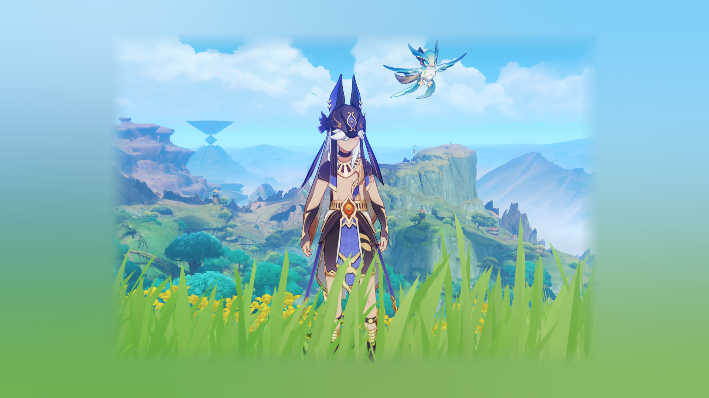
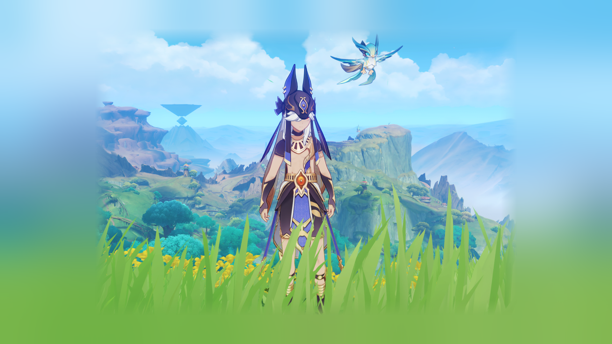
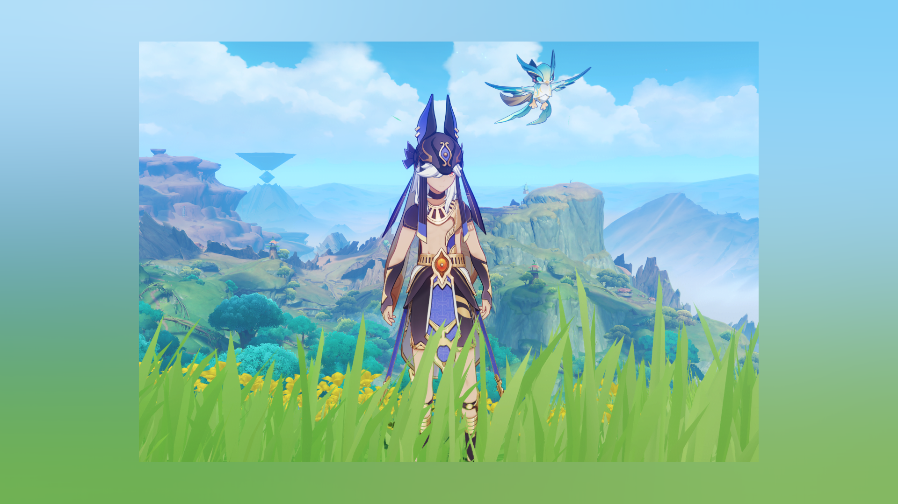
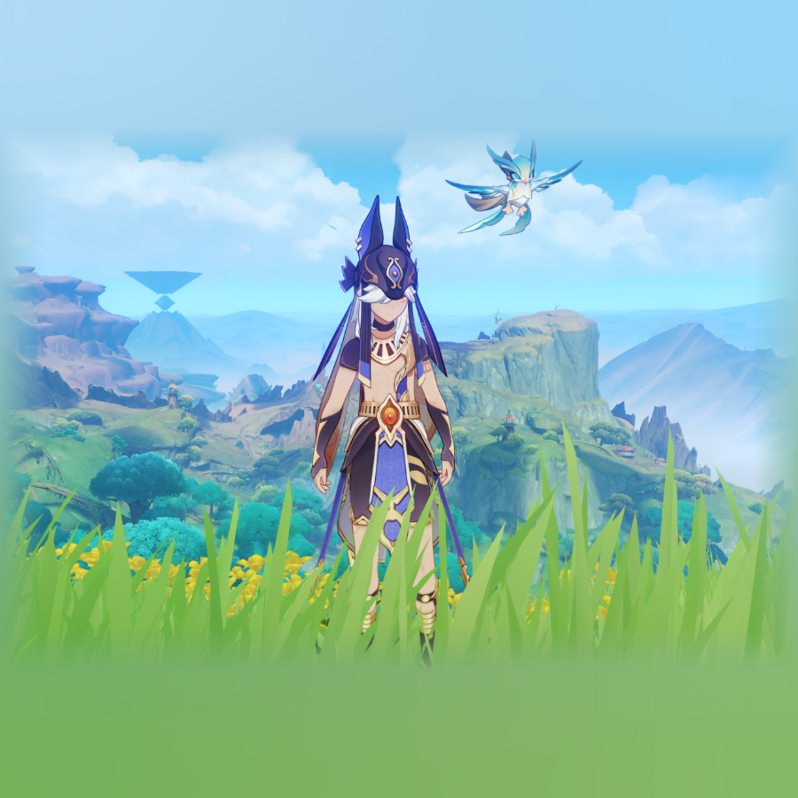
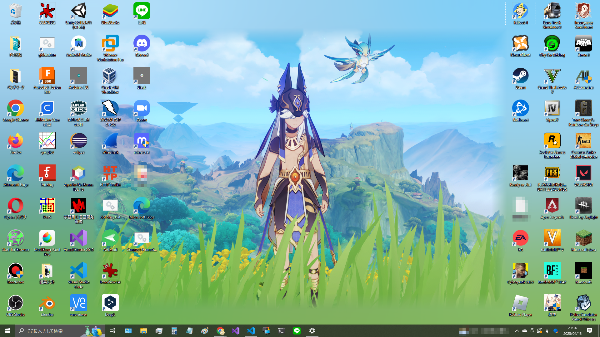
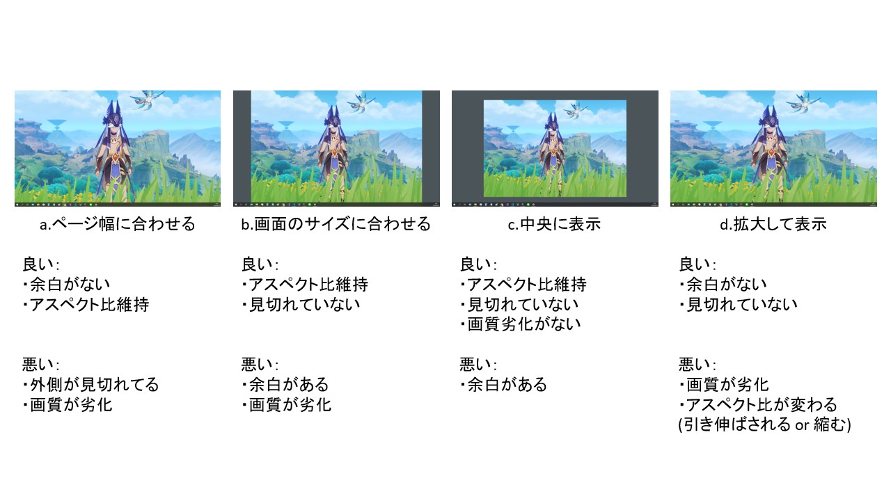

# 画像にアンビエント効果付与するツール

画像をいい感じにしてくれるツールです。
デスクトップ背景とかにおすすめです。(多分)

アンビエント(ambient)とは、環境という意味があり画像の雰囲気(というより色合い)に沿って画像を拡張するツールです。
詳細は[出力](#出力)へ。

※アンビエント自体には、YouTubeから着想を得ました
参考 - [YouTubeに新デザイン。没入感高める「アンビエントモード」など](https://av.watch.impress.co.jp/docs/news/1450257.html)

## 使用方法

コマンド
```
python src/ambient.py -i <IMAGE_PATH> -o <OUTPUT_PATH>
                        (-dw <DISPLAY_WIDTH> -dh <DISPLAY_HEIGHT> -gs <GAUSS_SIGMA> -ad <ALPHA_DIST> -h)
```

### 引数説明

| 引数 | 説明 | デフォルト値 | 型 | 備考 |
|:---|:---|:---|:---|:---|
| -i | 入力画像のパス | - | str | 必須 / .png only |
| -o | 出力画像のパス | "output.png" | str | .png only |
| -dw | ディスプレイの幅 | 1920 | int | - |
| -dh | ディスプレイの高さ | 1080 | int | - |
| -gs | ガウシアンフィルタの標準偏差 | 200.0 | float | - |
| -ad | 透過グラデーションの距離 | 50.0 | float | - |

#### ディスプレイの幅と高さ

ここでは、デスクトップ背景に設定する画像用に、ディスプレイのサイズとしていますが、実際は好きなサイズで構いません。

#### ガウシアンフィルタの標準偏差

背景画像(アンビエント)の拡散度合いです。
値が大きいほど拡散度合いが強くなります。

#### 透過グラデーションの距離

元画像の縁に適用する透過グラデーションの距離(幅)です。
値が大きいほど距離が長くなります。
また、`0`を指定すると透過グラデーションは適用されません。

### 出力

出力される画像は、以下のような感じになります。

```
python src/ambient.py -i sample1.png -o output1.png -dw 1920 -dh 1080 -gs 200.0 -ad 50.0
```


ガウシアンフィルタの標準偏差の変更
```
python src/ambient.py -i sample1.png -o output2.png -dw 1920 -dh 1080 -gs 80.0 -ad 50.0
```


透過グラデーションの距離の変更
```
python src/ambient.py -i sample1.png -o sample/output5.png -dw 1920 -dh 1080 -gs 200.0 -ad 20.0
```


```
python src/ambient.py -i sample1.png -o output3.png -dw 1920 -dh 1080 -gs 200.0 -ad 0.0
```


サイズの変更
```
python src/ambient.py -i sample1.png -o sample/output4.png -dw 900 -dh 900 -gs 200.0 -ad 50.0
```


出力された画像をデスクトップに適用するとこんな感じ。
(嗜好がバレる....w)


## 経緯

### アスペクト比が16:9でない画像のデスクトップ背景は厳しい...

ゲームのキャプチャ画像を適当の大きさにトリミングして、デスクトップ背景に設定してみました。(セノくんかわいいね)

デスクトップ背景設定にあたり、主に以下の４つの表示方法があります。("スパン"と"並べて表示"は目的外のため割愛)



for translation
- a.ページ幅に合わせる
    - 良い
        - 余白がない
        - アスペクト比維持
    - 悪い
        - 外側が見切れてる
        - 画質が劣化
- b.画面のサイズに合わせる
    - 良い
        - アスペクト比維持
        - 見切れていない
    - 悪い
        - 余白がある
        - 画質が劣化
- c.中央に表示
    - 良い
        - アスペクト比維持
        - 見切れていない
        - 画質劣化がない
    - 悪い
        - 余白がある
- d.拡大して表示
    - 良い
        - 余白がない
        - 見切れていない
    - 悪い
        - 画質が劣化
        - アスペクト比が変わる (引き伸ばされる or 縮む)

アスペクト比が16:9でない画像をデスクトップ背景にしようとすると、なんだかしっくりこない...

一番マシに思えるのが"中央に表示"で、画質劣化や見切れ、引き伸ばし/縮みがないです。(originalなので当然ではある)

そこで、この"中央に表示"で設定した際に生まれる余白をなんとかしたいなぁと思い、いい感じの方法を思いついたので実装しました。

## 説明及びサンプルに利用しているキャプチャ画像について

説明やサンプルとして利用しているキャプチャ画像は、オープンワールド・アクションRPG『原神』のゲーム内キャプチャ画像です。
ゲーム内キャプチャ画像は次のガイドラインを遵守して利用しています。

- 株式会社miHoYo ネットワークサービスにおける著作物の利用に関するガイドライン
    https://corp.mihoyo.co.jp/policy/guideline1.html

万が一、利用しているキャプチャ画像に対して、著作権侵害などの問題がある場合は、速やかに対処いたします。


